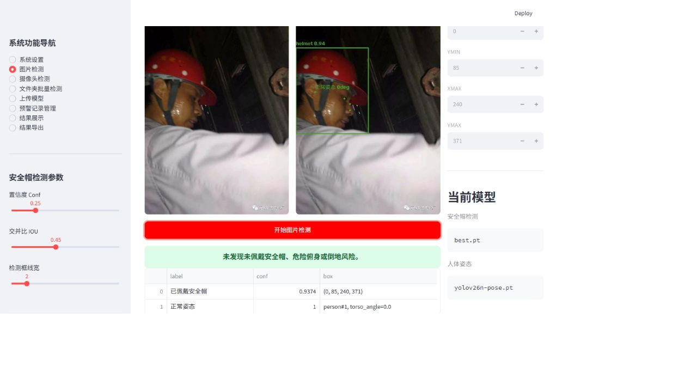
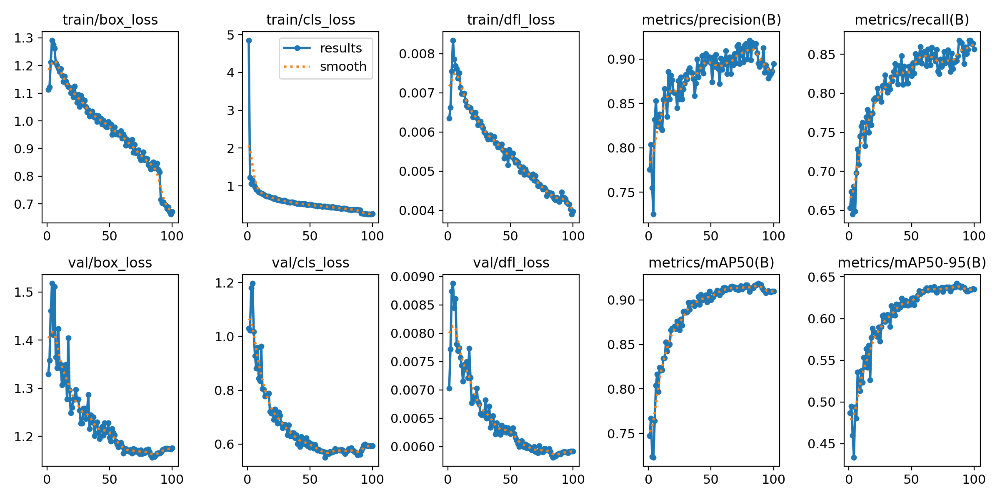
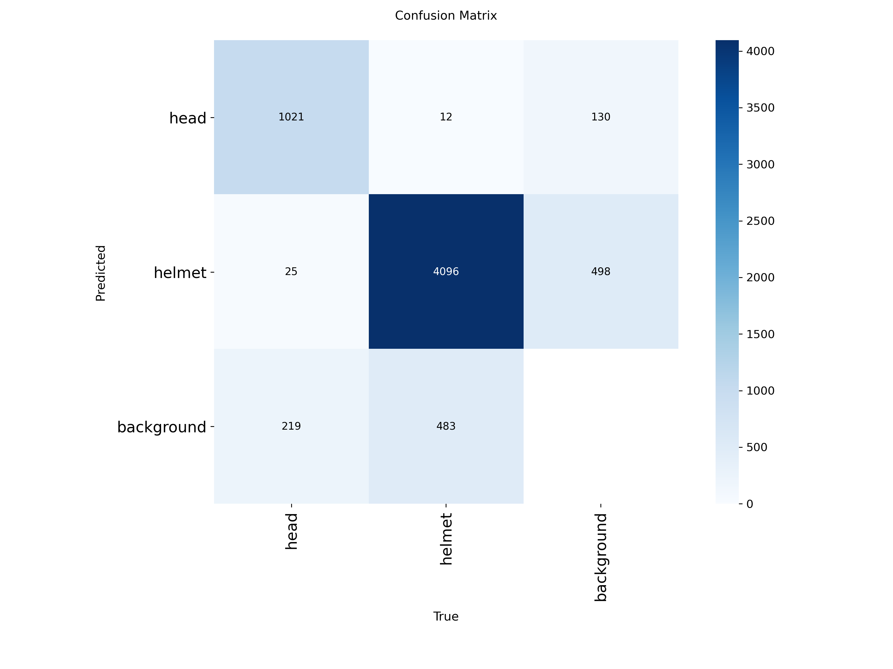
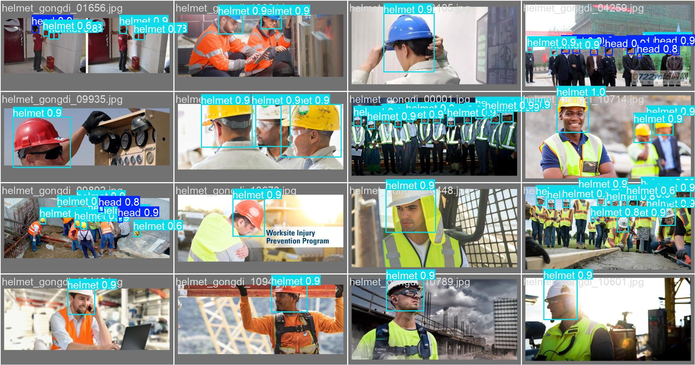

# 智慧工地安全行为识别与预警系统

基于 Python、YOLO 和 Streamlit 的视觉检测项目，围绕工地安全巡检中的图片检测、异常记录与结果导出搭建完整演示流程。安全帽模型区分 `head` 与 `helmet`；姿态模块利用人体关键点和几何阈值，提示危险俯身与疑似倒地。

> A Streamlit application for helmet detection and pose-based safety alerts, with image and batch inference, alert records, and CSV/Excel export.



实际运行的 Streamlit 页面，使用仓库自带 `helmet_gongdi_00240.jpg` 样例。截图中的检测结果来自本次 CPU 推理，未访问摄像头；图片和权重沿用原仓库，来源及复现范围见[验证记录](docs/verification-2026-08-31.md)。

## 可以体验什么

- **图片检测**：上传图片或选择仓库测试样例，查看检测框、类别、置信度与坐标。
- **批量检测**：处理指定文件夹中的图片，汇总结果并导出。
- **摄像头监测**：在本机授权摄像头后进行实时检测；无 GPU 时帧率会受影响。
- **预警管理**：保存异常截图，查看与更新处理状态，导出 CSV / Excel 记录。
- **模型与报告**：切换安全帽和姿态权重，查看训练曲线、混淆矩阵及样例。

姿态告警属于规则判断：系统使用 17 个人体关键点，结合角度与宽高比阈值推断异常姿态。它不能直接确认真实跌倒、临边位置或事故，应由人员复核。本项目适合学习和演示，尚不能替代现场安全管理。

## 快速运行

需要 Python、pip，以及足够安装 PyTorch / Ultralytics 的磁盘空间。下面是 Windows PowerShell 命令，在仓库根目录执行：

```powershell
python -m venv .venv
.\.venv\Scripts\Activate.ps1
python -m pip install -r requirements.txt
.\run_app.ps1
```

打开 <http://127.0.0.1:8502>。如果执行策略不允许激活脚本，可直接使用虚拟环境解释器：

```powershell
.\.venv\Scripts\python.exe -m pip install -r requirements.txt
.\.venv\Scripts\python.exe -m streamlit run app.py --server.address 127.0.0.1 --server.port 8502 --browser.gatherUsageStats false
```

首次演示建议在“图片检测”中选择一张测试集样例，点击“开始图片检测”，无需开启摄像头。应用优先使用可用 CUDA，否则使用 CPU。依赖未锁定版本；不同 Python、PyTorch 与显卡驱动组合需要分别验证。

本轮在 Windows / Python 3.13 下，使用 Streamlit 1.62.0、PyTorch 2.13.0 CPU、Ultralytics 8.4.136 和 OpenCV 5.0.0 完成了页面加载及仓库样例 `helmet_gongdi_00240.jpg` 的检测流程验证，无页面异常。样例与权重均来自本仓库；这只是功能冒烟检查，没有开启摄像头，也没有重新评估模型精度。

## 文件结构

| 路径 | 用途 |
| --- | --- |
| `app.py` | Streamlit 页面、推理与预警流程 |
| `run_app.ps1` | 本机启动脚本，默认端口 8502 |
| `models/best.pt` | 安全帽检测权重 |
| `models/yolov26n-pose.pt` | 人体姿态估计权重 |
| `data/HelmetHead/test/` | 随仓库提供的测试样例 |
| `data/samples/` | 报告页面中的展示图片 |
| `assets/train/` | 已有训练曲线、混淆矩阵与预测图 |
| `train.py`、`safety_dataset.yaml` | 训练入口与数据路径配置 |

运行后产生的 `violations/`、`export/`、`uploaded_models/` 已在 `.gitignore` 中排除。处理现场照片前应确认拍摄与使用权限，不要将人员照片或其他敏感信息提交到公开仓库。

## 已有训练记录

原仓库记录使用约 1.06 万张 HelmetHead 训练图像，检测类别为 `head` / `helmet`，并报告以下末轮指标：

| Precision | Recall | mAP@50 | mAP@50–95 |
| --- | --- | --- | --- |
| 0.917 | 0.830 | 0.885 | 0.604 |

这些数值来自仓库已有记录，**不是本轮重新训练或复测的结果**。完整训练集未包含在仓库中；它们也不代表在任意工地场景中的准确率。部署到新环境前，需要使用有代表性的数据重新评估。







## 重新训练

自行准备完整且有权使用的数据集，按 `train/images`、`valid/images`、`test/images` 及对应标签目录放入 `data/HelmetHead/`，检查 `safety_dataset.yaml` 后运行：

```powershell
python train.py
```

当前脚本使用 `yolo26s.pt` 作为初始化模型，训练参数包括 100 个 epoch、640 输入尺寸和 20 轮早停耐心值；检测到 CUDA 时使用 GPU，否则使用 CPU。初始化权重若未在本地，Ultralytics 可能需要联网获取。训练结果输出到 `runs/detect/yolo26s`；采用新权重时需在页面中切换，或替换默认模型文件。

## 技术与许可

Python · Ultralytics YOLO · OpenCV · Streamlit · PyTorch · Pandas

项目代码许可见 [LICENSE](LICENSE)（MIT）；第三方依赖、数据与模型仍适用其各自许可，复用前应分别确认。

维护者：[h1neolzr7f](https://github.com/h1neolzr7f) · [作品集](https://github.com/h1neolzr7f/dev-portfolio)
